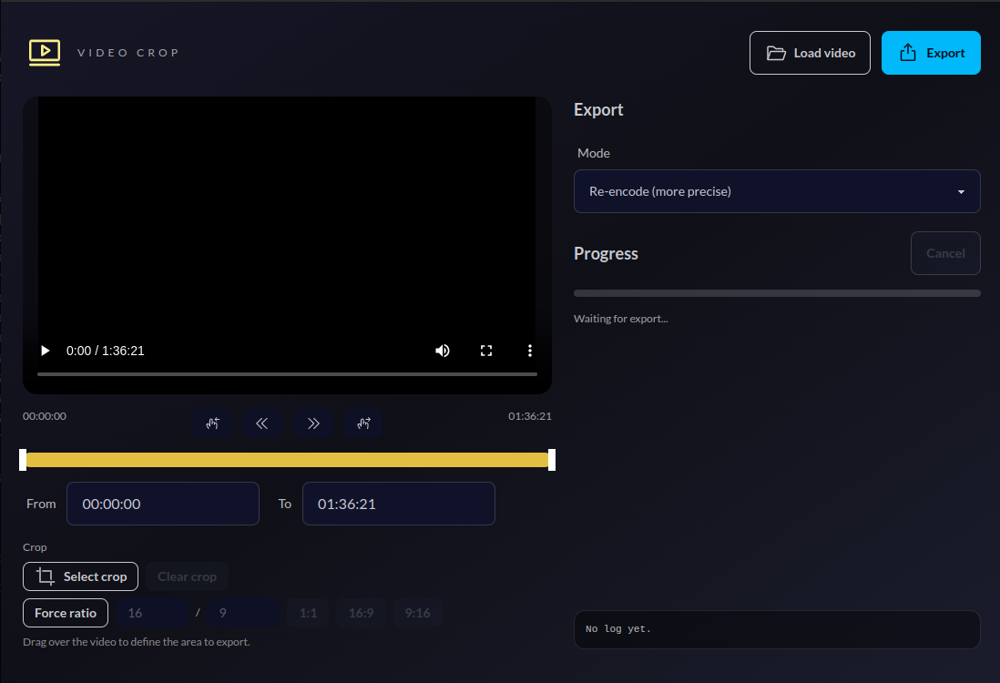

# Video Crop (Electron + FFmpeg)


Desktop app for Ubuntu that lets you load a large video, select a time range, define an image crop, and export the result using `ffmpeg`.

This app has been developed exclusively using vibecoding with Codex.



## What the app does and how it works

- Open a local video and preview it inside the app.
- Define a time range with a dual slider and frame controls.
- Optionally enable image cropping, draw the area, and adjust its corners.
- On export, the app runs `ffmpeg` to trim the time and, if there is an image crop, applies the `crop` filter.

## Requirements

- Only works on Ubuntu.
- Node.js + npm
- `ffmpeg` installed on the system (`sudo apt install ffmpeg`)

## Installation

```bash
npm install
```

## Development

```bash
npm run dev
```

## Packaging for Ubuntu

```bash
npm run dist
```

Generates `AppImage` and `deb` in `dist/`.

## Notes

- "Re-encode" mode is slower but more precise.
- "Fast cut" mode uses `-c copy` and may cut on the nearest keyframe.
